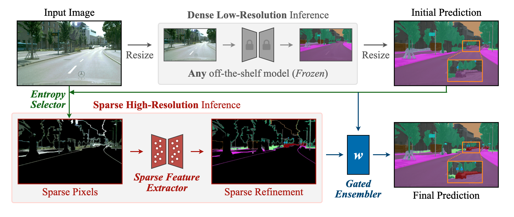
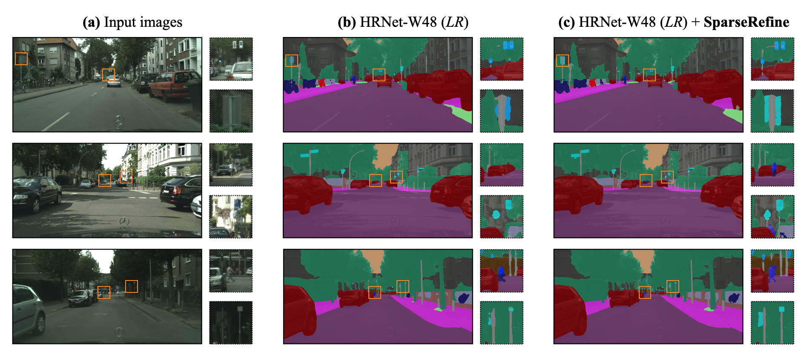

# Sparse Refinement for Efficient High-Resolution Semantic Segmentation
[[Paper](https://arxiv.org/abs/2407.19014)]



**SparseRefine** is a novel approach that enhances *dense low-resolution* predictions with *sparse high-resolution* refinements. It can be seamlessly integrated into any existing semantic segmentation model, regardless of CNN- or ViT-based. SparseRefine achieves significant speedup: **1.5 to 3.7 times** when applied to HRNet-W48, SegFormer-B5, Mask2Former-T/L and SegNeXt-L on Cityscapes, with negligible to no loss of accuracy.



## Installation

```
git clone https://github.com/mit-han-lab/sparserefine.git
cd sparserefine
conda create -n sparserefine python=3.9
pip install -r requirements.txt
pip install git+https://github.com/mit-han-lab/torchsparse
```

## Usage

### Data Preparation

To prepare the data, first download the [Cityscapes](https://www.cityscapes-dataset.com/) dataset and place it in the folder */dataset/cityscapes*. Next, you will need to produce low-resolution logits for various models and place them in the folder */dataset/cityscapes-preds*. We have released the low-resolution trained model weights and the respective configurations on our [HuggingFace Page](https://huggingface.co/mit-han-lab/SparseRefine). Once you have completed these steps, you will see the following directory structure.

```
dataset
├── cityscapes
│   ├── gtFine
│   ├── leftImg8bit
├── cityscapes-preds
│   ├── fcn-hr48-4xb2-512x1024-80k
│   ├── segformer_mit-b5_8xb1-160k_cityscapes-512x1024
│   ├── mask2former-swint-8xb2-512x1024-90k
│   ├── mask2former-swinl-8xb2-512x1024-90k
│   ├── segnext_mscan-l_8xb2-adamw-160k_cityscapes-640x1280
```

NOTE: If your data layout differs from the default configuration, you may need to modify the path in the *configs/data/cityscapes.yaml* file to reflect your own data path.

### Training

The configuration files for various models can be found in the *configs/experiment* folder. To run a specific model, simply change the experiment option for each run. For instance, to execute the HRNet model, use the following command:

```
./run.sh python scripts/train.py +experiment=cityscapes_hrnet48
```

For debugging purpose, you can run 
```
./run.sh python scripts/train.py +experiment=cityscapes_hrnet48 hydra.run.dir=/tmp loggers=csv
```
and it will not create a run directory and a wandb run.

## Related Projects
[TorchSparse: Efficient Point Cloud Inference Engine](https://github.com/mit-han-lab/torchsparse)

[SpConv: Spatially Sparse Convolution Library](https://github.com/traveller59/spconv)

[MMSegmentation](https://github.com/open-mmlab/mmsegmentation)